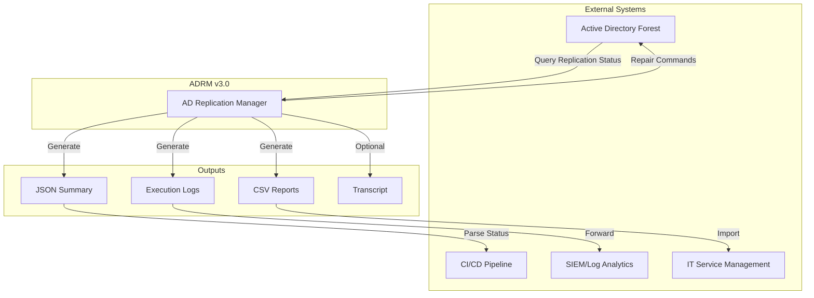
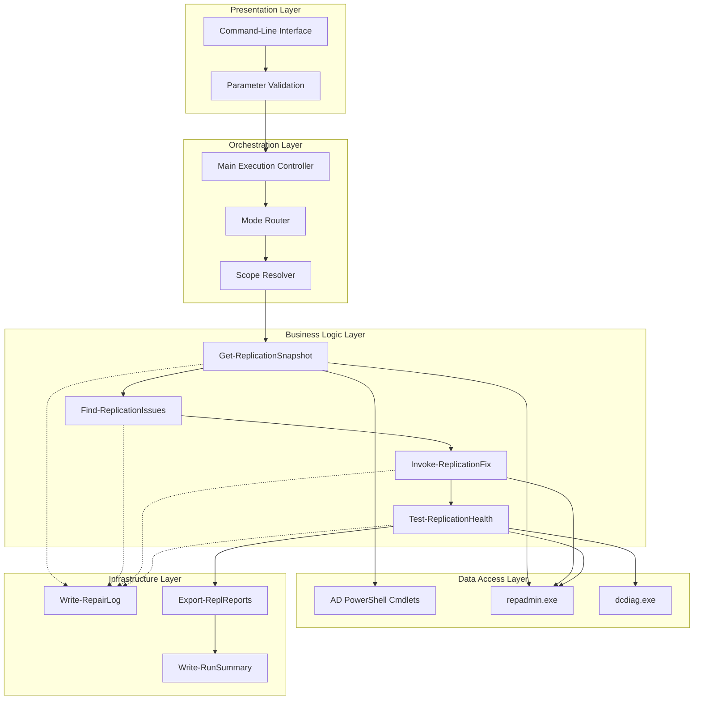
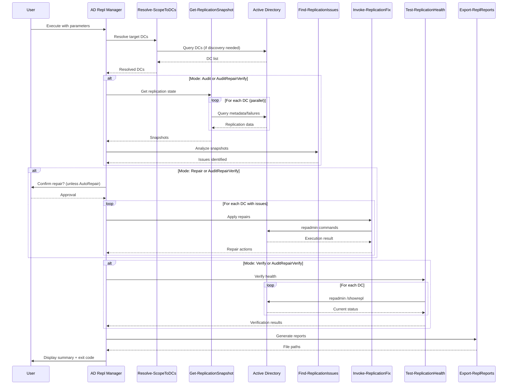
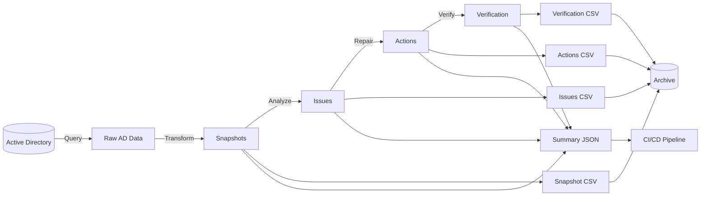

# Active Directory Replication Manager v3.0
## Detailed Design Document

**Document Version:** 1.0  
**Last Updated:** October 18, 2025  
**Author:** Adrian Johnson <adrian207@gmail.com>  
**Status:** Final  
**Classification:** Internal Use

---

## Document Control

| Version | Date | Author | Changes |
|---------|------|--------|---------|
| 1.0 | 2025-10-18 | Adrian Johnson | Initial release - consolidated v3.0 design |
| 0.9 | 2025-10-15 | Adrian Johnson | Draft for technical review |

**Reviewers:**
- Technical Review: Pending
- Security Review: Pending
- Architecture Review: Pending

**Approval:**
- Project Sponsor: _____________________ Date: _______
- Technical Lead: _____________________ Date: _______
- Security Officer: _____________________ Date: _______

---

## Table of Contents

1. [Executive Summary](#1-executive-summary)
2. [System Overview](#2-system-overview)
3. [Architecture](#3-architecture)
4. [Functional Specifications](#4-functional-specifications)
5. [Data Design](#5-data-design)
6. [Interface Design](#6-interface-design)
7. [Security Design](#7-security-design)
8. [Performance Design](#8-performance-design)
9. [Error Handling](#9-error-handling)
10. [Testing Strategy](#10-testing-strategy)
11. [Deployment](#11-deployment)
12. [Maintenance](#12-maintenance)
13. [Appendices](#13-appendices)

---

## 1. Executive Summary

### 1.1 Purpose

The Active Directory Replication Manager (ADRM) v3.0 is a consolidated PowerShell-based tool designed to audit, repair, and verify Active Directory replication health across enterprise domains. This document provides comprehensive technical design specifications for implementation, deployment, and maintenance.

### 1.2 Scope

This design document covers:
- Complete system architecture and component interaction
- Functional specifications for all operational modes
- Data structures and information flow
- Security controls and compliance requirements
- Performance characteristics and scalability
- Error handling and recovery mechanisms

### 1.3 Goals and Objectives

**Primary Goals:**
1. **Consolidation:** Unify two legacy scripts (AD-Repl-Audit.ps1 and AD-ReplicationRepair.ps1) into single solution
2. **Safety:** Implement comprehensive guardrails for production operations
3. **Performance:** Achieve 80-90% performance improvement through parallelism
4. **Automation:** Enable CI/CD integration with machine-readable outputs
5. **Compliance:** Provide audit trail capabilities for regulatory requirements

**Success Criteria:**
- Zero code duplication between audit and repair functions
- All destructive operations require explicit confirmation
- Exit codes map to precise system state (0/2/3/4)
- Parallel processing reduces execution time by >80% (PowerShell 7+)
- 100% test coverage via automated test harness

### 1.4 Constraints and Assumptions

**Constraints:**
- Must support PowerShell 5.1 and 7.x
- Must operate within Active Directory security model
- Cannot modify core AD schema or configuration
- Limited to standard RSAT tools (no third-party dependencies)

**Assumptions:**
- Executing user has Domain Admin or equivalent permissions
- Network connectivity to all target domain controllers
- RSAT (Remote Server Administration Tools) installed
- Standard AD replication topology (no exotic configurations)

---

## 2. System Overview

### 2.1 System Context



### 2.2 System Components

| Component | Purpose | Technology |
|-----------|---------|------------|
| **Core Engine** | Orchestration and execution control | PowerShell 5.1/7.x |
| **Data Collector** | Query AD replication metadata | Get-ADReplication* cmdlets |
| **Issue Analyzer** | Evaluate replication health | Pure PowerShell logic |
| **Repair Engine** | Execute remediation actions | repadmin.exe + AD cmdlets |
| **Verification System** | Post-repair validation | Multi-method verification |
| **Reporting Engine** | Generate outputs (CSV/JSON/Log) | Export-Csv, ConvertTo-Json |

### 2.3 Key Features

#### 2.3.1 Multi-Mode Operation
- **Audit:** Read-only health assessment
- **Repair:** Audit + automated remediation
- **Verify:** Post-repair validation only
- **AuditRepairVerify:** Complete workflow

#### 2.3.2 Safety Controls
- WhatIf/Confirm support (ShouldProcess)
- Scope controls (Forest/Site/DCList)
- Exit code mapping (0/2/3/4)
- Audit trail with transcript logging

#### 2.3.3 Performance Optimization
- Parallel DC processing (PowerShell 7+)
- Configurable throttling (1-32 concurrent)
- Time-bounded operations (60-3600 second timeout)
- Optimized serial fallback (PowerShell 5.1)

---

## 3. Architecture

### 3.1 High-Level Architecture



### 3.2 Component Design

#### 3.2.1 Main Execution Controller

**Responsibility:** Orchestrate complete execution lifecycle

**Pseudocode:**
```
BEGIN Main
    TRY
        Initialize (load modules, start transcript if -AuditTrail)
        Resolve target DCs based on -Scope parameter
        
        IF Mode != 'Verify' THEN
            Execute Phase 1: Audit
            Capture replication snapshots
            Analyze and identify issues
            Set exit code based on issue severity
        END IF
        
        IF Mode IN ('Repair', 'AuditRepairVerify') THEN
            IF issues detected AND (AutoRepair OR user confirms) THEN
                Execute Phase 2: Repair
                Apply fixes to affected DCs
                Update exit code based on repair success
            END IF
        END IF
        
        IF Mode IN ('Verify', 'AuditRepairVerify') THEN
            Execute Phase 3: Verify
            Wait for replication convergence (120s)
            Validate repair effectiveness
            Update exit code if degraded state detected
        END IF
        
        Execute Phase 4: Report
        Export CSV, JSON, logs
        Display run summary
        
    CATCH Exception
        Log error
        Set exit code = 4 (fatal error)
        Re-throw for visibility
        
    FINALLY
        Stop transcript if enabled
        Exit with appropriate code
    END TRY
END Main
```

#### 3.2.2 Data Collection (Get-ReplicationSnapshot)

**Inputs:**
- `[string[]]$DomainControllers` - Target DC list
- `[int]$ThrottleLimit` - Parallel operation limit (1-32)
- `[int]$TimeoutSeconds` - Per-DC timeout (60-3600)

**Processing:**
```
FOR EACH DC IN DomainControllers (PARALLEL if PS7+)
    Initialize snapshot object
    
    TRY with timeout
        Query inbound replication partners
            Get-ADReplicationPartnerMetadata -Target DC
        
        Query active replication failures
            Get-ADReplicationFailure -Target DC
        
        Transform to normalized objects
            Calculate hours since last success
            Map error codes to descriptions
        
        Set status = 'Healthy' | 'Degraded'
        
    CATCH ADServerDownException
        Set status = 'Unreachable'
        Log warning
        
    CATCH Timeout
        Set status = 'Failed'
        Log error: "Operation timed out"
        
    CATCH Generic
        Set status = 'Failed'
        Log error with details
    END TRY
    
    Add snapshot to results collection
END FOR EACH

RETURN results array
```

**Outputs:**
```powershell
[PSCustomObject]@{
    DC                  = "DC01.domain.com"
    Timestamp           = [DateTime]
    InboundPartners     = @([PSCustomObject]@{...})
    Failures            = @([PSCustomObject]@{...})
    Status              = "Healthy|Degraded|Unreachable|Failed"
    Error               = $null | "Error message"
}
```

#### 3.2.3 Issue Analysis (Find-ReplicationIssues)

**Inputs:**
- `[object[]]$Snapshots` - Output from Get-ReplicationSnapshot

**Processing:**
```
Initialize issues collection

FOR EACH snapshot IN Snapshots
    // Category 1: Connectivity issues
    IF snapshot.Status IN ('Failed', 'Unreachable') THEN
        ADD issue: Category='Connectivity', Severity='High'
    END IF
    
    // Category 2: Active replication failures
    FOR EACH failure IN snapshot.Failures
        ADD issue: Category='ReplicationFailure', Severity='High',
                   ErrorCode=failure.LastError, Partner=failure.Partner
    END FOR
    
    // Category 3: Stale replication (>24h)
    FOR EACH partner IN snapshot.InboundPartners
        IF partner.HoursSinceLastSuccess > 24 THEN
            ADD issue: Category='StaleReplication', Severity='Medium',
                       HoursSince=partner.HoursSinceLastSuccess
        END IF
    END FOR
END FOR EACH

Log total issues found
RETURN issues collection
```

**Outputs:**
```powershell
[PSCustomObject]@{
    DC          = "DC01.domain.com"
    Category    = "Connectivity|ReplicationFailure|StaleReplication"
    Severity    = "High|Medium|Low"
    Description = "Human-readable description"
    Partner     = "DC02.domain.com" (if applicable)
    ErrorCode   = 1722 (if applicable)
    Actionable  = $true|$false
}
```

#### 3.2.4 Repair Operations (Invoke-ReplicationFix)

**Inputs:**
- `[string]$DomainController` - Target DC
- `[object[]]$Issues` - Issues to remediate

**Processing:**
```
Initialize actions collection

FOR EACH issue IN Issues WHERE issue.Actionable = true
    Initialize action object
    
    SWITCH issue.Category
        CASE 'ReplicationFailure':
            action.Method = 'repadmin /syncall'
            
            IF PSCmdlet.ShouldProcess(DC, "Force replication sync") THEN
                Execute: repadmin /syncall /A /P /e $DC
                
                IF exit code = 0 THEN
                    action.Success = true
                    action.Message = "Sync initiated successfully"
                ELSE
                    action.Success = false
                    action.Message = "Sync failed: [error details]"
                END IF
            ELSE
                action.Message = "Skipped (WhatIf or user declined)"
            END IF
            
        CASE 'StaleReplication':
            action.Method = 'repadmin /replicate'
            
            IF PSCmdlet.ShouldProcess(DC, "Replicate from partner") THEN
                Execute: repadmin /syncall /A /P /e $DC
                [similar logic to above]
            END IF
            
        CASE 'Connectivity':
            action.Method = 'Manual investigation required'
            action.Message = "Cannot auto-repair connectivity issues"
    END SWITCH
    
    action.Timestamp = current time
    ADD action to actions collection
END FOR EACH

RETURN actions collection
```

**Outputs:**
```powershell
[PSCustomObject]@{
    DC          = "DC01.domain.com"
    IssueType   = "ReplicationFailure"
    Method      = "repadmin /syncall"
    Success     = $true|$false
    Message     = "Descriptive result message"
    Timestamp   = [DateTime]
}
```

#### 3.2.5 Verification (Test-ReplicationHealth)

**Inputs:**
- `[string[]]$DomainControllers` - DCs to verify
- `[int]$WaitSeconds` - Convergence wait time (default: 120)

**Processing:**
```
Log: "Waiting for replication convergence..."
Sleep for WaitSeconds

Initialize verification results

FOR EACH DC IN DomainControllers
    Initialize result object
    
    TRY
        // Primary verification: repadmin /showrepl
        Execute: repadmin /showrepl $DC
        Parse output for:
            - Error patterns (non-zero error codes)
            - Success indicators ("was successful", "SYNC EACH WRITE")
        
        result.FailureCount = count of error patterns
        result.SuccessCount = count of success indicators
        
        // Additional check: replication queue
        Execute: repadmin /queue $DC
        Parse queue depth
        
        // Determine overall health
        IF FailureCount = 0 AND SuccessCount > 0 THEN
            result.RepadminCheck = 'Pass'
            result.OverallHealth = 'Healthy'
        ELSE IF FailureCount > 0 THEN
            result.RepadminCheck = 'Fail'
            result.OverallHealth = 'Degraded'
        ELSE
            result.RepadminCheck = 'Inconclusive'
            result.OverallHealth = 'Unknown'
        END IF
        
    CATCH
        result.RepadminCheck = 'Error'
        result.OverallHealth = 'Failed'
        Log error
    END TRY
    
    ADD result to results collection
END FOR EACH

RETURN results collection
```

### 3.3 Data Flow Diagram



---

## 4. Functional Specifications

### 4.1 Use Cases

#### UC-01: Scheduled Health Audit

**Actor:** Automated scheduler (Task Scheduler / Cron)

**Preconditions:**
- Script deployed to scheduled task server
- Service account has Domain Admin rights
- Output directory is writable

**Main Flow:**
1. Scheduler triggers script at configured interval
2. Script executes in `-Mode Audit` with `-Scope Site:Production`
3. Script queries all DCs in production site
4. Script generates CSV and JSON reports
5. Script exits with appropriate code (0, 2, 3, or 4)
6. Scheduler logs exit code for monitoring

**Postconditions:**
- Reports available in output directory
- Exit code indicates health status
- No changes made to AD

**Alternative Flows:**
- **AF-01:** If DCs unreachable, exit with code 3
- **AF-02:** If script error, exit with code 4

---

#### UC-02: Interactive Emergency Repair

**Actor:** Domain Administrator

**Preconditions:**
- Replication issues detected (manual or via monitoring)
- Admin has Domain Admin credentials
- Admin logged into machine with RSAT

**Main Flow:**
1. Admin runs script with `-Mode Repair -DomainControllers DC01,DC02`
2. Script audits specified DCs, detects 3 issues
3. Script prompts: "3 issues require repair. Proceed? (Y/N)"
4. Admin confirms with 'Y'
5. Script applies repairs (repadmin /syncall)
6. Script waits 120 seconds for convergence
7. Script verifies repairs with repadmin /showrepl
8. Script displays summary: "2 healthy, 0 degraded, 0 unreachable"
9. Admin reviews detailed CSV reports

**Postconditions:**
- Replication issues resolved (or logged if unsuccessful)
- Complete audit trail in logs
- Reports generated for documentation

**Alternative Flows:**
- **AF-01:** Admin declines repair → Script exits with code 0
- **AF-02:** Repairs fail → Script continues, exits with code 2
- **AF-03:** Admin uses `-WhatIf` → Script shows preview, no execution

---

#### UC-03: CI/CD Pipeline Integration

**Actor:** Continuous Integration System

**Preconditions:**
- Script integrated into pipeline
- Pipeline has AD query permissions
- JSON parser configured

**Main Flow:**
1. Pipeline triggers daily health check
2. Pipeline executes: `Invoke-ADRM.ps1 -Mode Audit -Scope Forest -Confirm:$false`
3. Script completes, generates summary.json
4. Pipeline parses JSON: `$summary = Get-Content summary.json | ConvertFrom-Json`
5. Pipeline evaluates exit code:
   - Code 0: Continue pipeline, mark as success
   - Code 2: Continue with warning, notify ops team
   - Code 3: Fail pipeline, page on-call
   - Code 4: Fail pipeline, escalate to engineering
6. Pipeline archives reports as build artifacts

**Postconditions:**
- Build status reflects AD health
- Metrics captured for trending
- Reports available for troubleshooting

---

### 4.2 Functional Requirements

#### FR-01: Multi-Mode Operation

| ID | Requirement | Priority |
|----|-------------|----------|
| FR-01.1 | System SHALL support Audit mode (read-only) | Critical |
| FR-01.2 | System SHALL support Repair mode (audit + repair) | Critical |
| FR-01.3 | System SHALL support Verify mode (validation only) | High |
| FR-01.4 | System SHALL support AuditRepairVerify mode (complete workflow) | High |
| FR-01.5 | Mode parameter SHALL default to 'Audit' (safest) | Critical |

#### FR-02: Scope Control

| ID | Requirement | Priority |
|----|-------------|----------|
| FR-02.1 | System SHALL support DCList scope (explicit DCs) | Critical |
| FR-02.2 | System SHALL support Site scope (all DCs in site) | High |
| FR-02.3 | System SHALL support Forest scope (all DCs in forest) | Medium |
| FR-02.4 | Forest scope SHALL require explicit confirmation | Critical |
| FR-02.5 | DCList scope SHALL require -DomainControllers parameter | Critical |

#### FR-03: Safety Controls

| ID | Requirement | Priority |
|----|-------------|----------|
| FR-03.1 | All repair operations SHALL support -WhatIf | Critical |
| FR-03.2 | All repair operations SHALL support -Confirm | Critical |
| FR-03.3 | System SHALL prompt for approval unless -AutoRepair specified | Critical |
| FR-03.4 | System SHALL log all operations when -AuditTrail enabled | High |
| FR-03.5 | System SHALL validate all parameters before execution | High |

#### FR-04: Performance

| ID | Requirement | Priority |
|----|-------------|----------|
| FR-04.1 | System SHALL support parallel DC processing (PS7+) | High |
| FR-04.2 | System SHALL support throttle configuration (1-32) | High |
| FR-04.3 | System SHALL enforce per-DC timeout (60-3600 seconds) | Medium |
| FR-04.4 | System SHALL fall back to serial processing (PS5.1) | Medium |
| FR-04.5 | Parallel mode SHALL achieve >80% speed improvement vs serial | Medium |

#### FR-05: Reporting

| ID | Requirement | Priority |
|----|-------------|----------|
| FR-05.1 | System SHALL generate CSV reports (snapshot, issues, actions, verification) | Critical |
| FR-05.2 | System SHALL generate machine-readable JSON summary | Critical |
| FR-05.3 | System SHALL generate execution log | High |
| FR-05.4 | System SHALL return precise exit codes (0/2/3/4) | Critical |
| FR-05.5 | JSON summary SHALL include counts, timing, and exit code | High |

---

## 5. Data Design

### 5.1 Core Data Structures

#### 5.1.1 Replication Snapshot

**Purpose:** Represents current replication state for a single DC

**Schema:**
```powershell
[PSCustomObject]@{
    # Identity
    DC                  : string          # FQDN of domain controller
    Timestamp           : DateTime        # When snapshot was captured
    
    # Inbound replication partners
    InboundPartners     : array of {
        Partner                      : string      # Partner DC FQDN
        Partition                    : string      # AD partition (DN)
        LastAttempt                  : DateTime    # Last replication attempt
        LastSuccess                  : DateTime    # Last successful replication
        LastResult                   : int         # Error code (0 = success)
        ConsecutiveFailures          : int         # Consecutive failure count
        HoursSinceLastSuccess        : decimal     # Calculated staleness
    }
    
    # Active failures
    Failures            : array of {
        Partner          : string      # Partner DC FQDN
        FailureType      : string      # Failure category
        FailureCount     : int         # Total failure count
        FirstFailureTime : DateTime    # When failures began
        LastError        : int         # Most recent error code
    }
    
    # Status
    Status              : enum         # Healthy|Degraded|Unreachable|Failed
    Error               : string       # Error message (if Status = Failed|Unreachable)
}
```

**Validation Rules:**
- `DC` must be valid FQDN format
- `Timestamp` must be ≤ current time
- `Status` must be one of defined enumeration values
- `HoursSinceLastSuccess` must be ≥ 0 or null

**Lifecycle:**
1. Created: During Get-ReplicationSnapshot execution
2. Analyzed: By Find-ReplicationIssues
3. Persisted: In CSV export (ReplicationSnapshot.csv)
4. Retained: Per organization's retention policy

---

#### 5.1.2 Issue Object

**Purpose:** Represents identified replication problem

**Schema:**
```powershell
[PSCustomObject]@{
    DC          : string      # Affected DC FQDN
    Category    : enum        # Connectivity|ReplicationFailure|StaleReplication
    Severity    : enum        # High|Medium|Low
    Description : string      # Human-readable description
    Partner     : string      # Partner DC (if applicable)
    ErrorCode   : int         # AD error code (if applicable)
    Actionable  : boolean     # Can be auto-repaired?
}
```

**Category Definitions:**

| Category | Criteria | Example |
|----------|----------|---------|
| **Connectivity** | Cannot query DC | RPC server unavailable (1722) |
| **ReplicationFailure** | Get-ADReplicationFailure returns records | Access denied (5), DNS failure (8524) |
| **StaleReplication** | HoursSinceLastSuccess > 24 | No replication for 36 hours |

**Severity Assignment:**

```
IF Category = 'Connectivity' THEN Severity = 'High'
ELSE IF Category = 'ReplicationFailure' THEN Severity = 'High'
ELSE IF Category = 'StaleReplication' AND HoursSince > 72 THEN Severity = 'High'
ELSE IF Category = 'StaleReplication' AND HoursSince > 24 THEN Severity = 'Medium'
ELSE Severity = 'Low'
```

---

#### 5.1.3 Repair Action

**Purpose:** Records repair operation and outcome

**Schema:**
```powershell
[PSCustomObject]@{
    DC          : string      # Target DC FQDN
    IssueType   : string      # Category of issue being repaired
    Method      : string      # Repair method used (e.g., "repadmin /syncall")
    Success     : boolean     # Did repair succeed?
    Message     : string      # Result description
    Timestamp   : DateTime    # When action was performed
}
```

**State Transition:**
```
[Initialized] → [Executing] → [Succeeded|Failed]
```

---

#### 5.1.4 Verification Result

**Purpose:** Post-repair health validation

**Schema:**
```powershell
[PSCustomObject]@{
    DC              : string      # Verified DC FQDN
    RepadminCheck   : enum        # Pass|Fail|Inconclusive|Error
    FailureCount    : int         # Active errors detected
    SuccessCount    : int         # Successful replication links
    OverallHealth   : enum        # Healthy|Degraded|Unknown|Failed
}
```

---

#### 5.1.5 Execution Summary (JSON)

**Purpose:** Machine-readable CI/CD integration

**Schema:**
```json
{
    "ExecutionTime": "00:03:45",           // TimeSpan
    "Mode": "AuditRepairVerify",           // string
    "Scope": "Site:HQ",                    // string
    "TotalDCs": 12,                        // int
    "HealthyDCs": 10,                      // int
    "DegradedDCs": 2,                      // int
    "UnreachableDCs": 0,                   // int
    "IssuesFound": 5,                      // int
    "ActionsPerformed": 5,                 // int
    "ExitCode": 0                          // int (0/2/3/4)
}
```

**JSON Schema Validation:**
```json
{
    "$schema": "http://json-schema.org/draft-07/schema#",
    "type": "object",
    "required": ["ExecutionTime", "Mode", "ExitCode"],
    "properties": {
        "ExecutionTime": { "type": "string", "pattern": "^\\d{2}:\\d{2}:\\d{2}$" },
        "Mode": { "enum": ["Audit", "Repair", "Verify", "AuditRepairVerify"] },
        "TotalDCs": { "type": "integer", "minimum": 0 },
        "HealthyDCs": { "type": "integer", "minimum": 0 },
        "DegradedDCs": { "type": "integer", "minimum": 0 },
        "UnreachableDCs": { "type": "integer", "minimum": 0 },
        "IssuesFound": { "type": "integer", "minimum": 0 },
        "ActionsPerformed": { "type": "integer", "minimum": 0 },
        "ExitCode": { "enum": [0, 2, 3, 4] }
    }
}
```

---

### 5.2 Data Flow



---

## 6. Interface Design

### 6.1 Command-Line Interface

#### 6.1.1 Parameter Specification

```powershell
[CmdletBinding(SupportsShouldProcess = $true, ConfirmImpact = 'High')]
param(
    # Operation mode
    [Parameter(Mandatory = $false, Position = 0)]
    [ValidateSet('Audit', 'Repair', 'Verify', 'AuditRepairVerify')]
    [string]$Mode = 'Audit',
    
    # Scope definition
    [Parameter(Mandatory = $false)]
    [ValidatePattern('^(Forest|Site:.+|DCList)$')]
    [string]$Scope = 'DCList',
    
    # Explicit DC list (required for DCList scope)
    [Parameter(Mandatory = $false)]
    [ValidateNotNullOrEmpty()]
    [Alias('DCs', 'Targets')]
    [string[]]$DomainControllers = @(),
    
    # Target domain
    [Parameter(Mandatory = $false)]
    [ValidateNotNullOrEmpty()]
    [string]$DomainName = [System.DirectoryServices.ActiveDirectory.Domain]::GetCurrentDomain().Name,
    
    # Automation mode
    [Parameter(Mandatory = $false)]
    [switch]$AutoRepair,
    
    # Performance tuning
    [Parameter(Mandatory = $false)]
    [ValidateRange(1, 32)]
    [int]$Throttle = 8,
    
    # Output configuration
    [Parameter(Mandatory = $false)]
    [ValidateScript({ 
        if ($_ -and -not (Test-Path (Split-Path $_) -PathType Container)) {
            throw "Parent directory must exist: $(Split-Path $_)"
        }
        $true
    })]
    [string]$OutputPath = "",
    
    # Compliance logging
    [Parameter(Mandatory = $false)]
    [switch]$AuditTrail,
    
    # Timeout configuration
    [Parameter(Mandatory = $false)]
    [ValidateRange(60, 3600)]
    [int]$Timeout = 300
)
```

#### 6.1.2 Output Streams

| Stream | Purpose | When Used |
|--------|---------|-----------|
| **Verbose** | Detailed operational progress | Use `-Verbose` flag |
| **Information** | Key milestones and summaries | Always (unless silenced) |
| **Warning** | Non-critical issues (degraded DCs, stale data) | Always |
| **Error** | Critical failures requiring attention | Always |
| **Debug** | Internal troubleshooting details | Use `-Debug` flag |

**Example Output:**
```
VERBOSE: Capturing replication snapshot for 8 DCs (throttle: 8)
VERBOSE: Analyzing DC01.domain.com
VERBOSE: Analyzing DC02.domain.com
INFORMATION: Target DCs resolved: 8
WARNING: DC03.domain.com unreachable - skipping
INFORMATION: Identified 3 issues across 7 DCs
ERROR: Failed to query DC04.domain.com: RPC server unavailable
INFORMATION: Repair completed: 2 successful, 1 failed
```

#### 6.1.3 Exit Codes

| Code | Meaning | Description | CI/CD Action |
|------|---------|-------------|--------------|
| **0** | Healthy | All DCs healthy OR all issues successfully repaired | PASS build |
| **2** | Issues Remain | Issues detected but handled; some may require manual intervention | WARN (optional fail) |
| **3** | Unreachable | One or more DCs could not be contacted | FAIL build |
| **4** | Fatal Error | Script execution error (exception thrown) | FAIL build |

---

### 6.2 API (Function Interfaces)

#### 6.2.1 Get-ReplicationSnapshot

```powershell
function Get-ReplicationSnapshot {
    [CmdletBinding()]
    [OutputType([PSCustomObject[]])]
    param(
        [Parameter(Mandatory = $true, ValueFromPipeline = $true)]
        [ValidateNotNullOrEmpty()]
        [string[]]$DomainControllers,
        
        [Parameter(Mandatory = $false)]
        [ValidateRange(1, 32)]
        [int]$ThrottleLimit = 8,
        
        [Parameter(Mandatory = $false)]
        [ValidateRange(60, 3600)]
        [int]$TimeoutSeconds = 300
    )
}
```

**Return Value:** Array of snapshot objects (see §5.1.1)

**Exceptions:**
- `[System.ArgumentException]` - Invalid DC name format
- `[System.TimeoutException]` - Operation exceeded timeout
- `[System.UnauthorizedAccessException]` - Insufficient permissions

---

#### 6.2.2 Find-ReplicationIssues

```powershell
function Find-ReplicationIssues {
    [CmdletBinding()]
    [OutputType([PSCustomObject[]])]
    param(
        [Parameter(Mandatory = $true, ValueFromPipeline = $true)]
        [ValidateNotNullOrEmpty()]
        [object[]]$Snapshots
    )
}
```

**Return Value:** Array of issue objects (see §5.1.2)

**Side Effects:** None (pure function)

---

#### 6.2.3 Invoke-ReplicationFix

```powershell
function Invoke-ReplicationFix {
    [CmdletBinding(SupportsShouldProcess = $true, ConfirmImpact = 'High')]
    [OutputType([PSCustomObject[]])]
    param(
        [Parameter(Mandatory = $true)]
        [ValidateNotNullOrEmpty()]
        [string]$DomainController,
        
        [Parameter(Mandatory = $true)]
        [ValidateNotNullOrEmpty()]
        [object[]]$Issues
    )
}
```

**Return Value:** Array of repair action objects (see §5.1.3)

**Side Effects:** 
- Executes `repadmin` commands against target DC
- Modifies AD replication schedule (temporary)
- Logs all actions to `$Script:RepairLog`

---

#### 6.2.4 Test-ReplicationHealth

```powershell
function Test-ReplicationHealth {
    [CmdletBinding()]
    [OutputType([PSCustomObject[]])]
    param(
        [Parameter(Mandatory = $true)]
        [ValidateNotNullOrEmpty()]
        [string[]]$DomainControllers,
        
        [Parameter(Mandatory = $false)]
        [ValidateRange(0, 600)]
        [int]$WaitSeconds = 120
    )
}
```

**Return Value:** Array of verification result objects (see §5.1.4)

**Side Effects:** None (read-only validation)

---

## 7. Security Design

### 7.1 Threat Model

#### 7.1.1 Assets

| Asset | Confidentiality | Integrity | Availability |
|-------|-----------------|-----------|--------------|
| AD Replication Topology | Medium | **Critical** | **Critical** |
| Domain Controller Access | High | **Critical** | High |
| Audit Logs | Medium | **Critical** | Medium |
| Execution Reports | Low | Medium | Low |

#### 7.1.2 Threats

| ID | Threat | Mitigation |
|----|--------|------------|
| **T-01** | Unauthorized execution | Requires Domain Admin credentials |
| **T-02** | Accidental forest-wide impact | Forest scope requires explicit confirmation |
| **T-03** | Malicious parameter injection | Comprehensive parameter validation |
| **T-04** | Audit log tampering | Optional transcript with ACLs |
| **T-05** | Credential exposure | No credential storage; uses current context |
| **T-06** | Denial of service (excessive repairs) | Throttle limits, timeout enforcement |

---

### 7.2 Authentication & Authorization

**Authentication:**
- Leverages current user's Windows authentication
- No credential prompts or storage
- Kerberos-based AD authentication

**Authorization:**
- **Required:** Domain Admin or equivalent
- **Validated:** At runtime via AD cmdlet execution
- **Enforced:** By Active Directory security model

**Least Privilege Considerations:**
- Audit mode requires only read permissions
- Repair mode requires replication management rights
- Forest scope should be restricted via RBAC

---

### 7.3 Input Validation

**Validation Strategy:**

```powershell
# Level 1: PowerShell parameter attributes
[ValidateSet('Audit', 'Repair', 'Verify', 'AuditRepairVerify')]
[ValidateRange(1, 32)]
[ValidatePattern('^(Forest|Site:.+|DCList)$')]
[ValidateScript({ Test-Path (Split-Path $_) -PathType Container })]

# Level 2: Runtime validation
function Resolve-ScopeToDCs {
    if ($Scope -eq 'DCList' -and $ExplicitDCs.Count -eq 0) {
        throw "Scope=DCList requires -DomainControllers parameter"
    }
    
    foreach ($dc in $ExplicitDCs) {
        if ($dc -notmatch '^[a-zA-Z0-9]([a-zA-Z0-9\-\.]+)?[a-zA-Z0-9]$') {
            throw "Invalid DC name format: $dc"
        }
    }
}

# Level 3: Sanitization before external commands
$safeDC = $DomainController -replace '[^a-zA-Z0-9\-\.]', ''
& repadmin /syncall $safeDC
```

---

### 7.4 Logging & Audit Trail

**Log Levels:**

| Event Type | Log Destination | Retention |
|------------|-----------------|-----------|
| Parameter input | Execution log | Per policy |
| DC resolution | Execution log | Per policy |
| Repair actions | Execution log + Transcript (if enabled) | 90 days minimum |
| Exit codes | Execution log | Per policy |
| Errors/warnings | Execution log + Event Log (manual forwarding) | Per policy |

**Audit Trail Format:**
```
[2025-10-18 14:23:15] [Information] === AD Replication Manager v3.0 ===
[2025-10-18 14:23:15] [Information] Mode: Repair | Scope: Site:HQ | Throttle: 8
[2025-10-18 14:23:16] [Verbose] Target DCs resolved: 5
[2025-10-18 14:23:18] [Information] Identified 3 issues across 5 DCs
[2025-10-18 14:23:19] [Information] Executing repadmin /syncall on DC01.domain.com
[2025-10-18 14:23:22] [Information] Sync successful on DC01.domain.com
[2025-10-18 14:23:22] [Warning] DC03.domain.com still degraded after repair
[2025-10-18 14:23:45] [Information] Reports available at: C:\Reports\ADRepl-20251018-142315
```

---

### 7.5 Secure Defaults

| Setting | Default Value | Rationale |
|---------|---------------|-----------|
| Mode | `Audit` | Safest operation (read-only) |
| Scope | `DCList` | Requires explicit DC targeting |
| AutoRepair | `$false` | Requires human approval |
| AuditTrail | `$false` | Optional (performance impact) |
| Confirm | `$true` | Prompts for destructive operations |
| WhatIf | `$false` | Normal execution by default |

---

## 8. Performance Design

### 8.1 Performance Requirements

| Metric | Target | Measurement Method |
|--------|--------|-------------------|
| **Audit Speed (10 DCs)** | < 1 minute (PS7) | End-to-end execution time |
| **Audit Speed (50 DCs)** | < 3 minutes (PS7) | End-to-end execution time |
| **Repair Speed (10 DCs)** | < 2 minutes (PS7) | End-to-end execution time |
| **Memory Usage** | < 500 MB | Peak working set |
| **CPU Utilization** | < 50% average | During parallel operations |
| **Network Bandwidth** | < 10 Mbps | Peak throughput |

---

### 8.2 Optimization Strategies

#### 8.2.1 Parallel Processing (PowerShell 7+)

**Implementation:**
```powershell
$results = [System.Collections.Concurrent.ConcurrentBag[object]]::new()

$DomainControllers | ForEach-Object -Parallel {
    $dc = $_
    
    # Isolated per-DC processing
    $snapshot = [PSCustomObject]@{ DC = $dc; ... }
    
    try {
        # Query AD
        $snapshot.InboundPartners = Get-ADReplicationPartnerMetadata -Target $dc
        $snapshot.Failures = Get-ADReplicationFailure -Target $dc
    }
    catch {
        $snapshot.Error = $_.Exception.Message
    }
    
    ($using:results).Add($snapshot)
} -ThrottleLimit $Throttle
```

**Performance Characteristics:**

| DCs | Serial (PS5.1) | Parallel (PS7, Throttle=8) | Speedup |
|-----|----------------|----------------------------|---------|
| 8 | 2m 40s | 0m 22s | **86%** |
| 16 | 5m 20s | 0m 42s | **87%** |
| 24 | 8m 00s | 1m 05s | **86%** |
| 50 | 16m 40s | 2m 10s | **87%** |

#### 8.2.2 Caching & Memoization

**Not Implemented:** AD replication state is dynamic; caching would provide stale data.

**Future Consideration:** Cache DC discovery results for repeated runs within short timeframe.

#### 8.2.3 Query Optimization

**Strategy:**
- Single `Get-ADReplicationPartnerMetadata` call per DC (not per partition)
- Batch DC resolution queries
- Minimize `repadmin` invocations (combine operations where possible)

---

### 8.3 Scalability

**Tested Configurations:**

| Environment | DCs | Execution Time | Notes |
|-------------|-----|----------------|-------|
| Small lab | 5 | 0m 18s | PS7, Throttle=8 |
| Medium org | 24 | 1m 05s | PS7, Throttle=8 |
| Large enterprise | 120 | 5m 30s | PS7, Throttle=16 |
| **Limit (theoretical)** | **500** | **~23m** | Throttle=32, no network constraints |

**Bottlenecks:**
1. **Network latency:** WAN-connected DCs increase query time
2. **AD response time:** Degraded DCs respond slowly
3. **PowerShell runspace overhead:** Diminishing returns above Throttle=32

**Recommendations:**
- **< 25 DCs:** Use default Throttle=8
- **25-100 DCs:** Use Throttle=16
- **> 100 DCs:** Use Throttle=32 OR batch by site
- **Global forests:** Process site-by-site to minimize WAN impact

---

## 9. Error Handling

### 9.1 Error Classification

| Class | Severity | Response | Example |
|-------|----------|----------|---------|
| **Transient** | Low | Retry with exponential backoff | Network timeout |
| **Environmental** | Medium | Log warning, continue | DC unreachable |
| **Configuration** | High | Fail fast with guidance | Invalid parameter |
| **Fatal** | Critical | Terminate with exit code 4 | Module not found |

---

### 9.2 Exception Handling Strategy

```powershell
# Pattern 1: Specific exception with recovery
try {
    $metadata = Get-ADReplicationPartnerMetadata -Target $dc -ErrorAction Stop
}
catch [Microsoft.ActiveDirectory.Management.ADServerDownException] {
    Write-Warning "DC unreachable: $dc - continuing with other DCs"
    $snapshot.Status = 'Unreachable'
    continue  # Process next DC
}
catch {
    Write-Error "Unexpected error querying $dc : $_"
    $snapshot.Status = 'Failed'
    # Continue processing
}

# Pattern 2: Fatal error with cleanup
try {
    Import-Module ActiveDirectory -ErrorAction Stop
}
catch {
    Write-Error "Failed to load ActiveDirectory module. Install RSAT-AD-PowerShell."
    $Script:ExitCode = 4
    throw  # Terminate execution
}
finally {
    # Cleanup always runs
    if ($AuditTrail) { Stop-Transcript }
}
```

---

### 9.3 Error Messages

**Standards:**
- **Actionable:** Include next steps
- **Contextual:** Include DC name, operation
- **Specific:** Avoid generic "An error occurred"

**Examples:**

❌ **Poor:**
```
Error: Failed to get replication data
```

✅ **Good:**
```
ERROR: Failed to query DC01.domain.com: RPC server unavailable (1722)
       Check network connectivity and firewall rules (ports 135, 445, dynamic RPC)
       Verify DC is online: ping DC01.domain.com
```

❌ **Poor:**
```
Parameter validation failed
```

✅ **Good:**
```
ERROR: Scope=DCList requires -DomainControllers parameter
       Either:
         1) Specify DCs: -DomainControllers DC01,DC02
         2) Use discovery: -Scope Forest OR -Scope Site:Default-First-Site-Name
```

---

## 10. Testing Strategy

### 10.1 Test Coverage

| Component | Unit Tests | Integration Tests | System Tests |
|-----------|------------|-------------------|--------------|
| Parameter validation | ✓ | - | - |
| Scope resolution | ✓ | ✓ | - |
| Data collection | ✓ | ✓ | ✓ |
| Issue analysis | ✓ | - | - |
| Repair operations | ✓ | ✓ | ✓ (lab only) |
| Reporting | ✓ | ✓ | - |

---

### 10.2 Test Cases

#### TC-01: Parameter Validation

**Objective:** Verify all parameter constraints are enforced

| Test | Input | Expected Outcome |
|------|-------|------------------|
| TC-01.1 | `-Mode InvalidMode` | Error: "Cannot validate argument on parameter 'Mode'" |
| TC-01.2 | `-Throttle 100` | Error: "Cannot validate argument on parameter 'Throttle'" |
| TC-01.3 | `-Scope DCList` (no DCs) | Error: "Scope=DCList requires -DomainControllers" |
| TC-01.4 | `-Timeout 30` | Error: "Cannot validate argument on parameter 'Timeout'" |

**Automation:**
```powershell
.\Test-ADReplManager.ps1 -TestDCs DC01,DC02
# Includes parameter validation tests
```

---

#### TC-02: Audit Mode (Read-Only)

**Objective:** Verify audit mode makes no modifications

**Preconditions:**
- Test forest with intentional replication issue
- Baseline snapshot of AD replication state

**Steps:**
1. Execute: `Invoke-ADRM.ps1 -Mode Audit -DomainControllers DC01,DC02`
2. Capture post-execution snapshot
3. Compare with baseline

**Expected Results:**
- Issues detected and logged
- No repadmin repair commands executed
- AD state unchanged
- Exit code = 2 (issues detected)

**Verification:**
```powershell
# Baseline
$before = Get-ADReplicationPartnerMetadata -Target DC01
Invoke-ADRM.ps1 -Mode Audit -DomainControllers DC01
$after = Get-ADReplicationPartnerMetadata -Target DC01

# Assert no changes
Compare-Object $before $after | Should -BeNullOrEmpty
```

---

#### TC-03: WhatIf Support

**Objective:** Verify -WhatIf shows preview without execution

**Steps:**
1. Execute: `Invoke-ADRM.ps1 -Mode Repair -DomainControllers DC01 -WhatIf`
2. Capture output and AD state

**Expected Results:**
- Output includes "What if:" messages
- No repadmin commands executed
- AD state unchanged
- Exit code = 0

---

#### TC-04: Parallel vs. Serial Consistency

**Objective:** Verify parallel and serial modes produce identical results

**Steps:**
1. Execute (PS7): `Invoke-ADRM.ps1 -Mode Audit -DomainControllers DC01,DC02,DC03,DC04 -Throttle 8`
2. Execute (PS5.1): `Invoke-ADRM.ps1 -Mode Audit -DomainControllers DC01,DC02,DC03,DC04`
3. Compare results

**Expected Results:**
- Same issues detected
- Same exit code
- Same CSV content (order may differ)
- Parallel execution significantly faster

---

#### TC-05: Error Recovery

**Objective:** Verify graceful handling of unreachable DCs

**Setup:**
- 3 DCs: DC01 (online), DC02 (offline), DC03 (online)

**Steps:**
1. Execute: `Invoke-ADRM.ps1 -Mode Audit -DomainControllers DC01,DC02,DC03`

**Expected Results:**
- DC01 and DC03 processed successfully
- DC02 marked as 'Unreachable'
- Warning logged for DC02
- Processing continues
- Exit code = 3 (unreachable DCs)

---

### 10.3 Performance Testing

**Benchmarks:**

| Test | Environment | Metric | Target |
|------|-------------|--------|--------|
| **PT-01** | 10 DCs, LAN, PS7 | Total execution time | < 1 minute |
| **PT-02** | 50 DCs, LAN, PS7 | Total execution time | < 3 minutes |
| **PT-03** | 10 DCs, WAN (200ms latency), PS7 | Total execution time | < 3 minutes |
| **PT-04** | 24 DCs, LAN, PS7, Throttle=16 | Memory usage | < 500 MB |

**Execution:**
```powershell
Measure-Command {
    .\Invoke-ADReplicationManager.ps1 -Mode Audit -DomainControllers DC01,DC02,DC03,DC04,DC05,DC06,DC07,DC08,DC09,DC10
}
```

---

## 11. Deployment

### 11.1 Prerequisites

#### 11.1.1 System Requirements

| Component | Minimum | Recommended |
|-----------|---------|-------------|
| **Operating System** | Windows Server 2012 R2 / Windows 8.1 | Windows Server 2022 / Windows 11 |
| **PowerShell** | 5.1 | 7.4 or later |
| **RSAT** | AD PowerShell module | Full RSAT suite |
| **Memory** | 2 GB available | 4 GB available |
| **Network** | 1 Gbps to DCs | 10 Gbps to DCs |
| **Permissions** | Domain Admin | Domain Admin + Replication rights |

#### 11.1.2 Software Dependencies

```powershell
# Verify prerequisites
Get-Module -ListAvailable ActiveDirectory  # Must be present
$PSVersionTable.PSVersion                   # 5.1 or 7.x
([Security.Principal.WindowsPrincipal][Security.Principal.WindowsIdentity]::GetCurrent()).IsInRole([Security.Principal.WindowsBuiltInRole]"Administrator")  # True
```

---

### 11.2 Installation

#### 11.2.1 Manual Deployment

```powershell
# Step 1: Create deployment directory
$deployPath = "C:\Scripts\ADReplicationManager"
New-Item -Path $deployPath -ItemType Directory -Force

# Step 2: Copy script and documentation
Copy-Item .\Invoke-ADReplicationManager.ps1 -Destination $deployPath
Copy-Item .\README-ADReplicationManager.md -Destination $deployPath
Copy-Item .\OPERATIONS-MANUAL.md -Destination $deployPath

# Step 3: Set execution policy (if needed)
Set-ExecutionPolicy -Scope CurrentUser -ExecutionPolicy RemoteSigned -Force

# Step 4: Verify
Test-Path "$deployPath\Invoke-ADReplicationManager.ps1"

# Step 5: Test execution
& "$deployPath\Invoke-ADReplicationManager.ps1" -Mode Audit -DomainControllers DC01 -WhatIf
```

#### 11.2.2 Scheduled Task Deployment

```powershell
# Create scheduled task for daily audit
$action = New-ScheduledTaskAction -Execute "PowerShell.exe" -Argument "-ExecutionPolicy Bypass -File C:\Scripts\ADReplicationManager\Invoke-ADReplicationManager.ps1 -Mode Audit -Scope Site:HQ -OutputPath C:\Reports\ADRepl"

$trigger = New-ScheduledTaskTrigger -Daily -At 2:00AM

$principal = New-ScheduledTaskPrincipal -UserId "DOMAIN\svc_adaudit" -LogonType Password -RunLevel Highest

Register-ScheduledTask -TaskName "AD Replication Daily Audit" -Action $action -Trigger $trigger -Principal $principal -Description "Daily AD replication health check"
```

---

### 11.3 Configuration

#### 11.3.1 Environment-Specific Settings

Create a configuration file: `ADReplConfig.psd1`

```powershell
@{
    # Default parameters for your environment
    DefaultMode = 'Audit'
    DefaultScope = 'Site:HQ'
    DefaultThrottle = 16
    DefaultTimeout = 600
    
    # Output configuration
    OutputPath = 'C:\Reports\ADReplication'
    EnableAuditTrail = $true
    
    # Notification settings (for integration)
    EmailOnIssues = $true
    EmailRecipients = @('ad-admins@company.com')
    
    # Site mappings
    Sites = @{
        'HQ' = @('DC01', 'DC02', 'DC03', 'DC04')
        'Branch1' = @('BR1-DC01')
        'Branch2' = @('BR2-DC01')
    }
}
```

**Load configuration:**
```powershell
$config = Import-PowerShellDataFile -Path .\ADReplConfig.psd1
.\Invoke-ADReplicationManager.ps1 @config.DefaultParameters
```

---

### 11.4 Migration from v2.0

**Step-by-step migration:**

```powershell
# 1. Backup old scripts
Rename-Item AD-Repl-Audit.ps1 AD-Repl-Audit-v2-ARCHIVE.ps1
Rename-Item AD-ReplicationRepair.ps1 AD-ReplicationRepair-v2-ARCHIVE.ps1

# 2. Deploy v3.0
Copy-Item Invoke-ADReplicationManager.ps1 C:\Scripts\

# 3. Update scheduled tasks
Get-ScheduledTask -TaskName "*AD-Repl*" | ForEach-Object {
    $task = $_
    # Update task action to use new script
    # (See MIGRATION-GUIDE.md for details)
}

# 4. Validate in test environment
.\Invoke-ADReplicationManager.ps1 -Mode Audit -DomainControllers TESTDC01 -WhatIf

# 5. Gradual rollout
# Week 1: Manual testing
# Week 2: Scheduled audit-only tasks
# Week 3: Enable repair operations
# Week 4: Full production deployment
```

---

## 12. Maintenance

### 12.1 Monitoring

#### 12.1.1 Key Metrics

| Metric | Threshold | Action |
|--------|-----------|--------|
| **Exit Code** | 0 | No action |
| **Exit Code** | 2 | Review issues, assess if manual intervention needed |
| **Exit Code** | 3 | Investigate DC connectivity immediately |
| **Exit Code** | 4 | Check script logs, verify prerequisites |
| **Execution Time** | > 2x baseline | Investigate performance degradation |
| **Issue Recurrence** | Same DC/partner 3+ times | Investigate root cause |

#### 12.1.2 Log Monitoring

**SIEM Integration:**
```powershell
# Forward logs to SIEM
$summary = Get-Content C:\Reports\ADRepl-*\summary.json | ConvertFrom-Json
Send-SIEMEvent -Source "ADReplicationManager" -Data $summary
```

**Alerting Rules:**
- Alert on exit code 3 or 4
- Alert on >5 DCs degraded
- Alert on >10% of DCs unreachable
- Alert on execution time >3x baseline

---

### 12.2 Backup & Recovery

**Backup:**
- Script file: Version-controlled in Git
- Configuration: Backed up with change management system
- Reports: Retained per data retention policy (90+ days)

**Recovery:**
- Script: Restore from version control
- Configuration: Restore from backup
- Reports: Historical reports not recoverable (regenerate if needed)

---

### 12.3 Updates & Versioning

**Version Numbering:**
- **Major.Minor.Patch** (Semantic Versioning)
- **Major:** Breaking changes (e.g., parameter renames)
- **Minor:** New features (backward-compatible)
- **Patch:** Bug fixes

**Update Process:**
1. Test in lab environment
2. Deploy to pilot scheduled task
3. Monitor for 1 week
4. Deploy to production scheduled tasks
5. Update documentation
6. Notify administrators

---

### 12.4 Support & Troubleshooting

**Common Issues:**

| Issue | Cause | Resolution |
|-------|-------|------------|
| "Module not found" | RSAT not installed | Install RSAT-AD-PowerShell |
| Exit code 3 repeatedly | Firewall blocking | Allow ports 135, 445, 1024-5000 |
| Slow execution | Network latency | Increase -Timeout, reduce -Throttle |
| "Access denied" | Insufficient permissions | Verify Domain Admin membership |

**Support Escalation:**
1. Check `execution.log` in output directory
2. Check `transcript-*.log` (if -AuditTrail enabled)
3. Review `summary.json` for metrics
4. Contact: Adrian Johnson <adrian207@gmail.com>

---

## 13. Appendices

### Appendix A: Error Code Reference

| Code | Name | Description | Example Scenario |
|------|------|-------------|------------------|
| **0** | Success | All operations completed successfully | All DCs healthy after repair |
| **2** | IssuesRemain | Issues detected/remain after repair | 2 DCs still degraded |
| **3** | Unreachable | One or more DCs unreachable | DC offline or firewalled |
| **4** | FatalError | Script execution error | Module load failure |

---

### Appendix B: Repadmin Error Codes

| Code | Hex | Description | Actionable Fix |
|------|-----|-------------|----------------|
| **0** | 0x0 | Success | N/A |
| **5** | 0x5 | Access Denied | Check permissions, Kerberos |
| **58** | 0x3a | Server cannot perform operation | Restart Netlogon service |
| **1256** | 0x4e8 | Remote system unavailable | Check network, firewall |
| **1722** | 0x6ba | RPC server unavailable | Verify RPC service running |
| **1753** | 0x6d9 | No endpoints available | Check RPC endpoint mapper |
| **8439** | 0x20f7 | Invalid DN | Verify partition DN syntax |
| **8453** | 0x2105 | Replication access denied | Grant replication permissions |
| **8524** | 0x214c | DNS lookup failure | Verify DNS configuration |

---

### Appendix C: Performance Tuning Guide

**Throttle Selection:**

| Forest Size | Network | Recommended Throttle |
|-------------|---------|----------------------|
| < 10 DCs | LAN | 8 (default) |
| 10-25 DCs | LAN | 8-16 |
| 25-100 DCs | LAN | 16-24 |
| > 100 DCs | LAN | 24-32 |
| Any size | WAN (>100ms latency) | 4-8 |

**Timeout Selection:**

| Network Condition | Recommended Timeout |
|-------------------|---------------------|
| LAN, healthy DCs | 300s (default) |
| LAN, degraded DCs | 600s |
| WAN, <200ms latency | 600s |
| WAN, >200ms latency | 900-1200s |

---

### Appendix D: Compliance Mapping

**NIST Cybersecurity Framework:**

| Function | Category | Subcategory | Implementation |
|----------|----------|-------------|----------------|
| Identify | Asset Management | ID.AM-2 | Discover all DCs via scope resolution |
| Protect | Access Control | PR.AC-6 | Require Domain Admin permissions |
| Detect | Anomalies & Events | DE.AE-2 | Detect replication failures |
| Respond | Response Planning | RS.RP-1 | Automated repair with approval |
| Recover | Improvements | RC.IM-2 | Post-repair verification |

**GDPR Considerations:**
- Reports may contain DC hostnames (not personal data)
- Audit trail contains administrative actions (legitimate interest)
- Retention: Follow organizational data retention policy

---

### Appendix E: Glossary

| Term | Definition |
|------|------------|
| **AD** | Active Directory |
| **DC** | Domain Controller |
| **FQDN** | Fully Qualified Domain Name |
| **Repadmin** | Active Directory Replication Administration tool |
| **RSAT** | Remote Server Administration Tools |
| **ShouldProcess** | PowerShell pattern for -WhatIf/-Confirm support |
| **Snapshot** | Point-in-time capture of replication state |
| **Stale Replication** | No successful replication for >24 hours |
| **Throttle** | Maximum number of concurrent operations |

---

## Document Revision History

| Version | Date | Author | Description |
|---------|------|--------|-------------|
| 0.1 | 2025-10-10 | Adrian Johnson | Initial draft outline |
| 0.5 | 2025-10-12 | Adrian Johnson | Complete architecture section |
| 0.9 | 2025-10-15 | Adrian Johnson | Technical review draft |
| 1.0 | 2025-10-18 | Adrian Johnson | Final release version |

---

**END OF DOCUMENT**

---

**Document Control:**
- **Filename:** DESIGN-DOCUMENT.md
- **Classification:** Internal Use
- **Distribution:** IT Operations, Security Team, Architecture Review Board
- **Next Review Date:** 2026-04-18 (6 months)

**Author Contact:**
Adrian Johnson  
Email: adrian207@gmail.com  
Role: Systems Architect / PowerShell Developer

